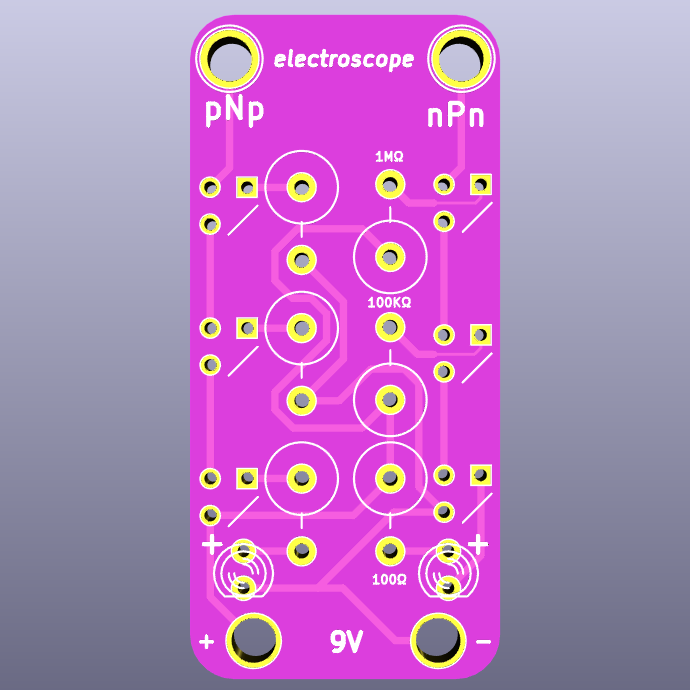

# electroscope (through-hole edition)

This is a similar board to the [surface mount electroscope](https://github.com/davidk/electroscope) but is easier (or harder, depending on your manufacturing viewpoint) to assemble and source parts for.

<a href="https://oshpark.com/shared_projects/JK9TLh1I"></img></a>

### Bill of Materials

This BOM specifies the amount needed for _one_ board. Parts have been translated from their surface mount equivalents.

| Quantity | Description | Digikey Part Number | Board Placement |
| -------- | ----------- | ----------- | --------------- |
| 3        | 2N3906      | [2N3906D26ZCT-ND](https://www.digikey.com/products/en?keywords=2N3906D26ZCT-ND) | Right (label: 2N3906) |
| 3 	   | 2N3904	 | [2N3904FS-ND](https://www.digikey.com/products/en?keywords=2N3904FS-ND) | Left (label: 2N3904) |
| 2        | 100 ohm resistor | [100QBK-ND](https://www.digikey.com/product-detail/en/CFR-25JB-52-100R/100QBK-ND/246) | Bottom (label: 100 ohm) |
| 2        | 100k ohm resistor | [100KQBK-ND](https://www.digikey.com/products/en?keywords=100kQBK-ND) | Middle (label: 100k ohm) |
| 2	   | 1M ohm resistor | [1.0MQBK-ND](https://www.digikey.com/product-detail/en/yageo/CFR-25JB-52-1M/1.0MQBK-ND/99) | Top (label: 1M ohm) |

### Battery connector

| Quantity | Description | Digikey Part Number | Board Placement |
| -------- | ----------- | ----------- | --------------- |
| 1        | 9v through-hole battery snap - long | [36-968-ND](https://www.digikey.com/product-detail/en/keystone-electronics/968/36-968-ND/151577) | 9V terminals (verify before soldering by attaching to a 9V battery -- reworking afterwards is difficult without specialized tools/materials) |

or

| Quantity | Description | Digikey Part Number | Board Placement |
| -------- | ----------- | ----------- | --------------- |
| 1        | 9v through-hole battery snap - short | [36-967-ND](https://www.digikey.com/product-detail/en/keystone-electronics/967/36-967-ND/2745660) |  9V terminals (verify before soldering by attaching to a 9V battery -- reworking afterwards is difficult without specialized tools/materials) |

#### LEDs

| Quantity | Description | Digikey Part Number | Board Placement |
| -------- | ----------- | ----------- | --------------- |
| 2        | 3mm LEDs | (Red: [160-1704-ND](http://www.digikey.com/product-search/en?vendor=0&keywords=160-1704-ND) / Green: [160-1958-ND](http://www.digikey.com/product-search/en?vendor=0&keywords=160-1958-ND) | Bottom (verify orientation before soldering!) |
